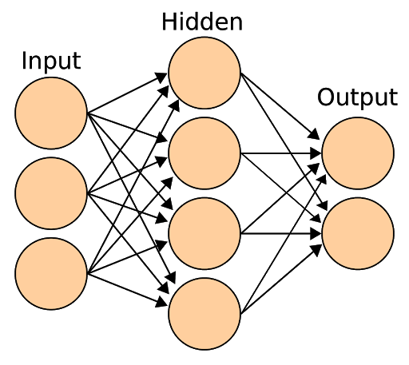

# LSTM Stock Predictor

- - -

### Evaluate the performance of each model

* I'm evaluating the performance of each model by using the testing data. Here are my answers to the below questions:

* Which model has a lower loss?
* The loss in Closing Prices' model is lower than the FNG indicators. The loss is 0.06518411636352539

* Which model tracks the actual values better over time?
* Looking at the plots I'd say the Closing Prices tracks the actual values better over time. 

* Which window size works best for the model?
* There is only one Window Size which is 10 days. I have used 10 for both of them and have gotten the same results. Please explain if I'm not getting this part.